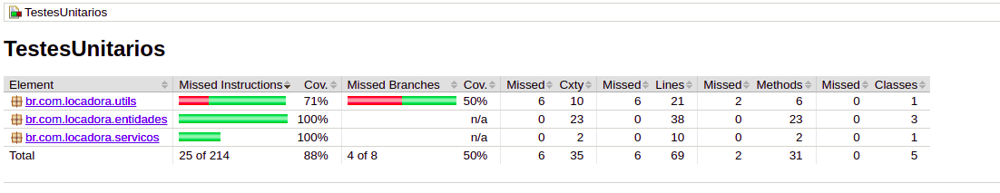
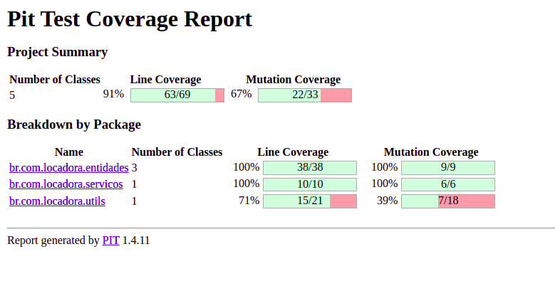
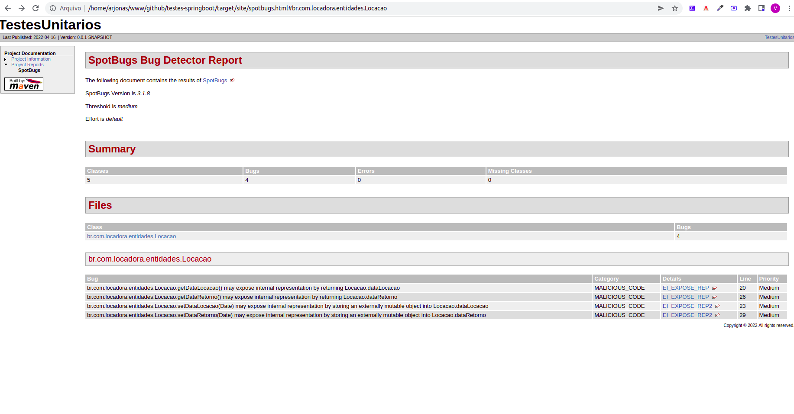

# Testes

## Objetivo
Neste projeto realizei alguns testes unitários utilizando o Junit, configurei o plugin do Jacoco, para obter um relátório de cobertura de testes, e o plugin pitest, para gerar um relatório de cobertura de teste de mutação. 

## Tecnologias

- Java 8 ou superior
- Maven

## Como rodar o projeto

```
mvn clean test
```

Após rodar o comando acima, você vai obter alguns relatórios. 


## Jacoco 

Acesse o diretório: "target/site/jacoco" e abra o arquivo index.html no seu navegador, o resultado será o abaixo:



## Mutação (Pitest)

Acesse o diretório "target/pit-reports/202204161936" e abra o arquivo index.html no seu navegador, o resultado será o abaixo:




## Spot Bugs

Acesse o diretório "target/site/" e abra o arquivo spotbugs.html no seu navegador, o resultado será o abaixo:



